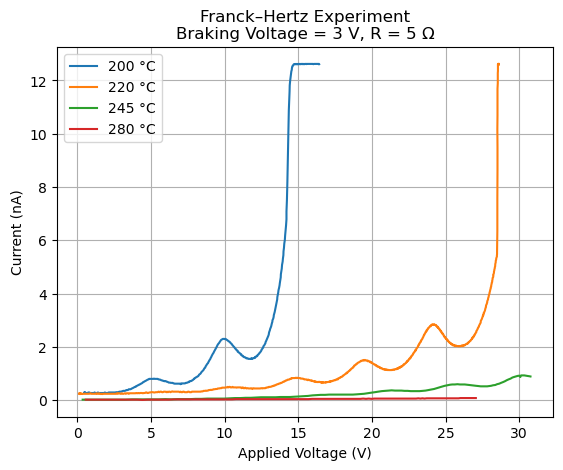
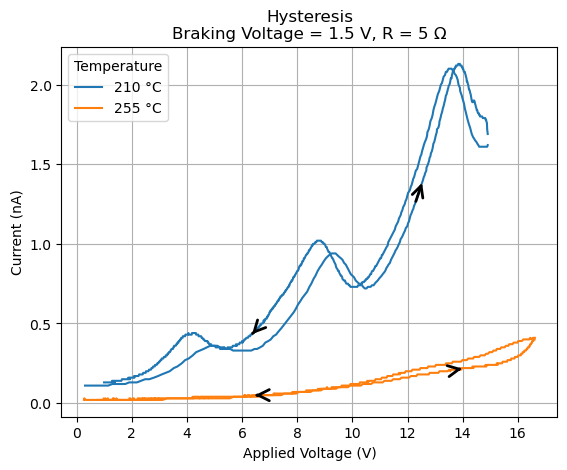
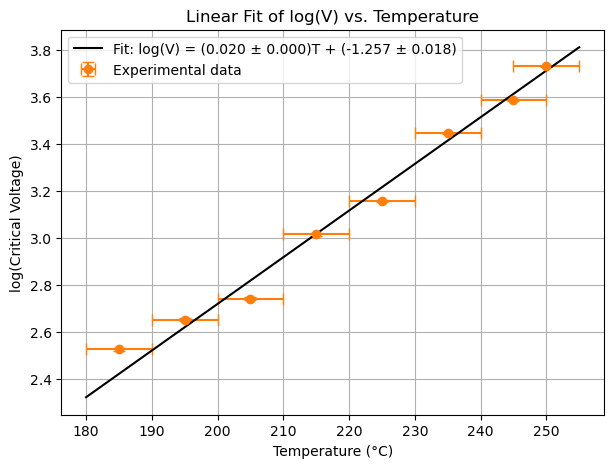

# ⚛️ Franck–Hertz Experiment

Experimental analysis of the **Franck–Hertz experiment** using voltage-current measurements obtained from a mercury-filled Franck–Hertz tube.

This project analyzes experimental data collected during a laboratory experiment at the **Universidad Autónoma de Madrid (UAM)**. The accompanying Python code was developed to process, visualize, and analyze the measurements stored in the `MRF/` directory.

The analysis investigates the characteristic current minima produced by inelastic electron-atom collisions and uses their voltage separation to estimate the **excitation energy of mercury atoms** and the corresponding **photon wavelength**.

## Overview

The Franck–Hertz experiment provides direct experimental evidence for the quantization of atomic energy levels. Electrons are accelerated through a gas of mercury atoms and undergo inelastic collisions when their kinetic energy reaches the excitation energy of the atoms.

The experimental measurements analyzed in this project were **personally acquired by the author during the corresponding laboratory session at the Universidad Autónoma de Madrid**.

The dataset includes measurements performed under different experimental conditions:

* Tube temperatures
* Braking voltages
* Circuit resistances
* Voltage sweep directions

The analysis includes both standard current-voltage measurements and hysteresis measurements.

## Experimental Data

The original experimental measurements are stored in the `MRF/` directory.

These files contain the voltage-current data recorded during the laboratory experiment. The Python script reads these files directly, processes the measurement format, and performs the subsequent analysis.

The data therefore correspond to **actual experimental measurements rather than simulated or publicly sourced data**.

The general workflow is:

```text
Laboratory experiment
        ↓
Experimental voltage-current measurements
        ↓
Data stored in MRF/
        ↓
Python data processing
        ↓
Signal processing and statistical analysis
        ↓
Franck–Hertz excitation energy
        ↓
Photon wavelength
```

## Analysis

The Python script performs the following steps:

1. Loads voltage-current measurements from the experimental data files.
2. Converts the original measurement format into numerical NumPy arrays.
3. Plots experimental **I–V curves** for different temperatures, braking voltages, and resistances.
4. Analyzes **hysteresis** by comparing increasing and decreasing voltage sweeps.
5. Investigates the dependence of the critical voltage on the tube temperature.
6. Performs a weighted linear fit of $\log(V)$ as a function of temperature.
7. Calculates the coefficient of determination $R^2$.
8. Smooths experimental current signals using a Gaussian filter.
9. Automatically detects consecutive current minima using `scipy.signal.find_peaks`.
10. Determines the mean voltage separation between consecutive minima.
11. Estimates the **excitation energy of mercury atoms**.
12. Calculates the corresponding **photon wavelength**.

## Results

### Excitation Energy

The voltage separation between consecutive current minima was determined from several selected experimental measurements.

The resulting mean voltage difference was:

$$
\Delta V = (4.93 \pm 0,41),\mathrm{V}
$$

For singly charged electrons, the corresponding excitation energy is numerically equal to the voltage difference in electronvolts:

$$
\boxed{
E_{\mathrm{exc}} = (4.93 \pm 0.41),\mathrm{eV}
}
$$

This gives the experimental estimate of the excitation energy of mercury atoms obtained from the Franck–Hertz measurements.

### Photon Wavelength

Using the relation

$$
E = \frac{hc}{\lambda},
$$

the wavelength associated with the excitation energy was calculated as

$$
\lambda = \frac{hc}{E}.
$$

Using $hc \approx 1240,\mathrm{eV,nm}$, the resulting wavelength is:

$$
\boxed{
\lambda = (251.7 \pm 20.9),\mathrm{nm}
}
$$

## Experimental Figures

The following figures illustrate representative results obtained from the experimental data.

### I–V Curves



*Representative experimental current-voltage curves obtained for different tube temperatures.*

### Hysteresis



*Comparison between increasing and decreasing voltage sweeps.*

### Temperature Dependence



*Experimental critical voltage as a function of tube temperature, together with the fitted model.*

## Methods

### I–V Curves

The experimental current is plotted as a function of the applied accelerating voltage for different experimental conditions.

These curves reveal the characteristic oscillatory structure associated with repeated inelastic collisions between electrons and mercury atoms.

### Hysteresis Analysis

Measurements were performed while both increasing and decreasing the applied voltage.

The two voltage sweeps are plotted together to investigate possible hysteresis effects in the experimental system.

### Temperature Dependence

The critical voltage is analyzed as a function of the Franck–Hertz tube temperature.

The transformation

$$
y = \log(V_{\mathrm{critical}})
$$

is used to obtain a linear relationship with temperature:

$$
\log(V_{\mathrm{critical}}) = aT+b.
$$

The fit is performed using the experimental uncertainty in the critical voltage as weights.

The quality of the fit is evaluated using the coefficient of determination:

$$
R^2 =
1 -
\frac{
\sum_i (y_i-y_i^{\mathrm{fit}})^2
}{
\sum_i (y_i-\bar{y})^2
}.
$$

### Minimum Detection

The excitation energy is estimated from the spacing between consecutive current minima.

Because the experimental data contain noise, the current signal is first smoothed using a Gaussian filter:

```python
smoothed_current = gaussian_filter1d(
    current,
    sigma=smoothing_sigma
)
```

Local minima are then detected by applying `find_peaks` to the negative current:

```python
minimum_indices, _ = find_peaks(
    -smoothed_current,
    distance=minimum_distance,
    prominence=0.02
)
```

The voltage differences between consecutive minima are then calculated and averaged across the selected experimental measurements.

## Technologies

* **Python** — analysis and data processing
* **NumPy** — numerical calculations and data handling
* **SciPy** — signal processing, peak detection, and curve fitting
* **Matplotlib** — experimental data visualization

## Scientific Context

The Franck–Hertz experiment was first performed by **James Franck and Gustav Hertz** in 1914 and provided experimental evidence that atoms absorb energy in discrete quantities.

The experiment played an important role in establishing the quantized nature of atomic energy levels and was recognized with the **1925 Nobel Prize in Physics**, awarded to Franck and Hertz.

## Reproducibility

The analysis is designed to be reproducible from the original experimental measurements.

The raw experimental data collected during the laboratory session are included in the `MRF/` directory, while the analysis procedure and numerical parameters are defined in the Python source code.

This allows the analysis to be reproduced by running the provided script on the original measurements.

## Author

**Mathias Rendón Fernández**

Physics student — Universidad Autónoma de Madrid
